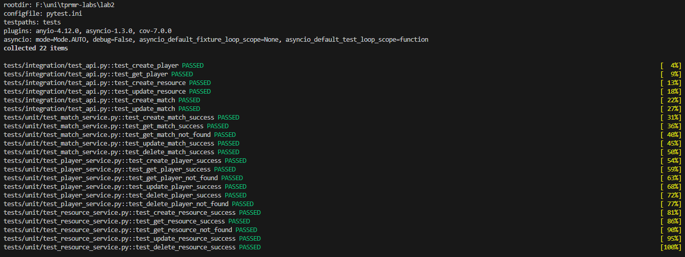
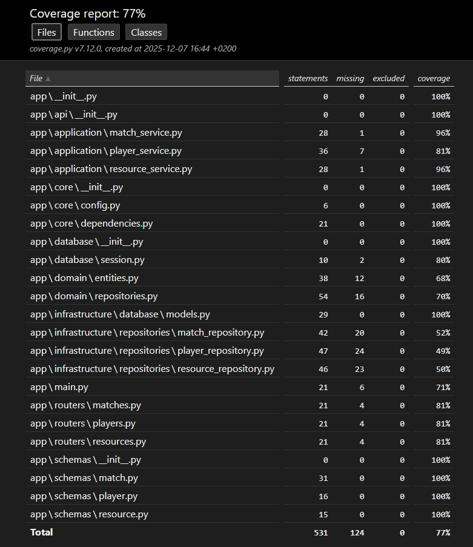

    # Multiplayer Client API

    REST API для управління гравцями, ресурси та матчами, створений з використанням FastAPI.

    ## Опис проєкту

    Цей проєкт реалізує повноцінний CRUD API для управління гравцями, ресурсами та матчами мультиплеєрної гри, побудований за принципами Clean Architecture та SOLID. 
    Архітектура поділена на три основні шари: domain, який містить доменні сутності та абстрактні інтерфейси репозиторіїв; application, що реалізує сервісний шар для бізнес-логіки та працює через інтерфейси репозиторіїв; та infrastructure, який включає конкретні реалізації репозиторіїв, моделі бази даних та інтеграцію з асинхронною SQL-базою даних. 
    Застосовано dependency injection, що дозволяє легко підмінювати репозиторії на мок-об’єкти для тестування. 
    API дозволяє створювати, переглядати, оновлювати та видаляти гравців, керувати ресурсами гравців, створювати та оновлювати матчі, відслідковувати результати та тривалість, а також фільтрувати та отримувати списки об’єктів з пагінацією. 
    Проєкт забезпечує повний набір unit та інтеграційних тестів, включаючи перевірку сервісного шару з використанням моків, тестування API endpoints з тестовою базою даних, високе покриття коду (77%) та обробку граничних випадків і помилок.

    ## Функціональність

    - Створення нових гравців, ресурсів, матчів
    - Оновлення гравців, ресурсів, матчів
    - Видалення гравців, ресурсів, матчів
    - Отримання всього списку гравців, ресурсів, матчів
    - Отримання статистики матчів 

    ## Технології

    - Python 3.11+
    - FastAPI - вебфреймворк для створення API
    - Pydantic - валідація даних
    - Uvicorn - ASGI сервер
    - SQLAlchemy (async) - робота з базою даних
    - SQLite / PostgreSQL - реляційна база даних для зберігання даних
    - Pytest - фреймворк для unit та інтеграційного тестування
    - HTTPX - асинхронний клієнт для тестування API
    - Alembic - міграції бази даних


    ## Встановлення

    1. Клонуйте репозиторій:
    ```bash
    git clone <посилання-на-ваш-репозиторій>
    cd fastapi-tasks
    ```

    2. Створіть віртуальне середовище:
    ```bash
    python -m venv venv
    ```

    3. Активуйте віртуальне середовище:
    - Windows: `venv\Scripts\activate`
    - Linux/Mac: `source venv/bin/activate`

    4. Встановіть залежності:
    ```bash
    pip install -r requirements.txt
    ```

    ## Запуск
    ```bash
    uvicorn app.main:app --reload
    ```

    Застосунок буде доступний за адресою: http://localhost:8000

    ## Документація API

    - Swagger UI: http://localhost:8000/docs
    - ReDoc: http://localhost:8000/redoc

    ## API Endpoints

    | Метод | Endpoint | Опис |
    |-------|----------|------|
    | GET | / | Коренева сторінка з інформацією про API |
    | POST | /players/ | Створити нового гравця |
    | GET | /players/ | Отримати список гравців (з пагінацією) |
    | GET | /players/{player_id} | Отримати гравця за ID |
    | PUT | /players/{player_id} | Оновити інформацію про гравця |
    | DELETE | /players/{player_id} | Видалити гравця |
    | POST | /resources/ | Створити новий ресурс |
    | GET | /resources/ | Отримати список ресурсів (з фільтрацією за гравцем) |
    | GET | /resources/{resource_id} | Отримати ресурс за ID |
    | PUT | /resources/{resource_id} | Оновити ресурс |
    | DELETE | /resources/{resource_id} | Видалити ресурс |
    | POST | /matches/ | Створити новий матч |
    | GET | /matches/ | Отримати список матчів (з фільтрацією за статусом) |
    | GET | /matches/{match_id} | Отримати матч за ID |
    | PUT | /matches/{match_id} | Оновити матч |
    | DELETE | /matches/{match_id} | Видалити матч |
    | GET | /matches/stats/summary | Отримати статистику матчів |

    ### Приклади використання

    #### Створення гравця
    ```json
    POST /players/
    {
        "level": 12,
        "rating": 1450,
        "username": "DragonSlayer"
    }
    ```

    #### Фільтрація матчів
    ```
    GET /matches/?skip=0&limit=50&status=completed
    ```

    ## Скріншоти

    
    

    ## Реалізовані особливості

    - **Валідація даних**: використано Pydantic схеми з обмеженнями типів, мінімальних та максимальних значень для полів гравців, ресурсів та матчів (username, level, amount, duration, status)
    - **Пагінація**: параметри skip та limit реалізовані у ендпоінтах GET /players/, GET /resources/, GET /matches/
    - **Фільтрація**: фільтр за player_id для ресурсів, фільтр за status для матчів
    - **Статистика:** ендпоінт /matches/stats/summary повертає кількість матчів, їх статуси, середню тривалість та відсоток завершених
    - **Документація**: автоматично генерується Swagger UI (/docs) та ReDoc (/redoc)
    - **Обробка помилок**: коректні HTTP статус коди та повідомлення
    - **Unit та інтеграційне тестування**: створено повний набір тестів для сервісного шару та ендпоінтів API з моками та тестовою базою даних, що гарантує стабільність і коректність роботи системи.  
    - **Clean Architecture та SOLID**: проєкт структуровано з виділенням domain, application та infrastructure шарів, використано репозиторії через абстрактні інтерфейси та сервісний шар, що забезпечує розширюваність та підтримку коду.  
    - **Асинхронність**: застосовано async/await для роботи з базою даних та обробки запитів API, що покращує продуктивність та масштабованість.  
