    # Multiplayer Client API

    REST API для управління гравцями, ресурси та матчами, створений з використанням FastAPI.

    ## Опис проєкту

    Цей проєкт реалізує повноцінний CRUD API для управління гравцями, ресурсами та матчами мультиплеєрної гри. 
    За допомогою API можна створювати нових гравців, додавати ресурси, керувати матчами, а також переглядати, оновлювати або видаляти наявні записи. 
    Крім базових операцій CRUD, API підтримує фільтрацію даних, що дозволяє швидко отримувати потрібну інформацію. 
    Інтерактивна документація Swagger UI дозволяє тестувати всі ендпоїнти прямо у браузері та перевіряти роботу API без додаткових інструментів.

    Проєкт виконаний з використанням FastAPI та асинхронного доступу до бази даних PostgreSQL через SQLAlchemy і asyncpg. 
    Для контейнеризації використовується Docker та Docker Compose, що дозволяє легко запускати весь стек сервісів як у розробницькому, так і в тестовому середовищі. 
    Файл Dockerfile побудований на офіційному образі Python, залежності встановлюються через pip, а код додатка копіюється у контейнер із правильним налаштуванням команди запуску.

    Для конфігурації проєкту використовується файл .env, де зберігаються змінні оточення для підключення до бази даних та інших параметрів додатка. 
    Також створено .env.example як шаблон, щоб інші розробники могли швидко налаштувати проєкт у своєму середовищі. 
    Файл .env додано до .gitignore, щоб уникнути випадкового поширення конфіденційних даних. 
    Завдяки правильному читанню змінних оточення код додатка автоматично підбирає налаштування для підключення до бази даних і параметрів сервісу.

    Для забезпечення персистентності даних налаштовано томи Docker для збереження даних PostgreSQL.
    Перевірка збереження даних здійснюється шляхом зупинки контейнерів командою docker-compose down без видалення томів, а потім повторного запуску сервісів.

    Щоб оптимізувати Docker-образ, створено файл .dockerignore, який виключає непотрібні файли, такі як локальне Python-оточення, кеш-пакети, файли git та тимчасові файли. У Dockerfile також використано правильний порядок інструкцій для ефективного кешування шарів, а для сервісів налаштовані політики перезапуску.

    ## Функціональність

    - Створення нових гравців, ресурсів, матчів
    - Оновлення гравців, ресурсів, матчів
    - Видалення гравців, ресурсів, матчів
    - Отримання всього списку гравців, ресурсів, матчів
    - Отримання статистики матчів 

    ## Технології

    - Python 3.11+
    - FastAPI - вебфреймворк для створення API
    - Pydantic - валідація даних
    - Uvicorn - ASGI сервер


    ## Встановлення

    1. Клонуйте репозиторій:
    ```bash
    git clone <посилання-на-ваш-репозиторій>
    cd fastapi-tasks
    ```

    2. Створіть віртуальне середовище:
    ```bash
    python -m venv venv
    ```

    3. Активуйте віртуальне середовище:
    - Windows: `venv\Scripts\activate`
    - Linux/Mac: `source venv/bin/activate`

    4. Встановіть залежності:
    ```bash
    pip install -r requirements.txt
    ```

    ## Запуск
    ```bash
    uvicorn app.main:app --reload
    ```

    Застосунок буде доступний за адресою: http://localhost:8000

    ## Документація API

    - Swagger UI: http://localhost:8000/docs
    - ReDoc: http://localhost:8000/redoc

    ## API Endpoints

    | Метод | Endpoint | Опис |
    |-------|----------|------|
    | GET | / | Коренева сторінка з інформацією про API |
    | POST | /players/ | Створити нового гравця |
    | GET | /players/ | Отримати список гравців (з пагінацією) |
    | GET | /players/{player_id} | Отримати гравця за ID |
    | PUT | /players/{player_id} | Оновити інформацію про гравця |
    | DELETE | /players/{player_id} | Видалити гравця |
    | POST | /resources/ | Створити новий ресурс |
    | GET | /resources/ | Отримати список ресурсів (з фільтрацією за гравцем) |
    | GET | /resources/{resource_id} | Отримати ресурс за ID |
    | PUT | /resources/{resource_id} | Оновити ресурс |
    | DELETE | /resources/{resource_id} | Видалити ресурс |
    | POST | /matches/ | Створити новий матч |
    | GET | /matches/ | Отримати список матчів (з фільтрацією за статусом) |
    | GET | /matches/{match_id} | Отримати матч за ID |
    | PUT | /matches/{match_id} | Оновити матч |
    | DELETE | /matches/{match_id} | Видалити матч |
    | GET | /matches/stats/summary | Отримати статистику матчів |

    ### Приклади використання

    #### Створення гравця
    ```json
    POST /players/
    {
        "level": 12,
        "rating": 1450,
        "username": "DragonSlayer"
    }
    ```

    #### Фільтрація матчів
    ```
    GET /matches/?skip=0&limit=50&status=completed
    ```

    ## Скріншоти

    Для зручності надано скріншоти виконання команд, запущених контейнерів, документації Swagger UI.

    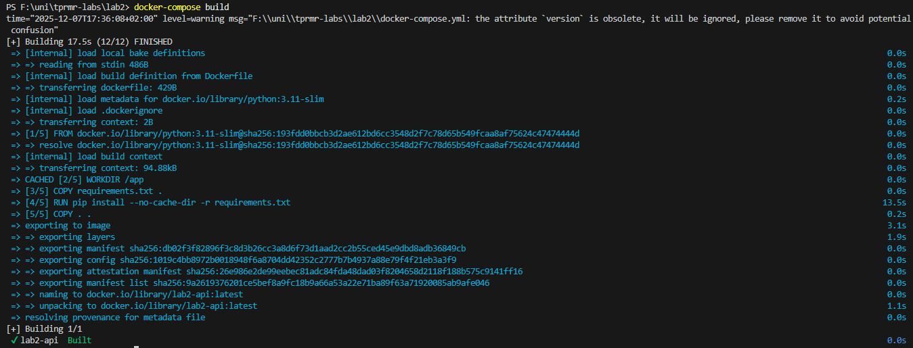
    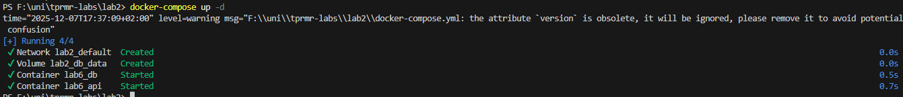
    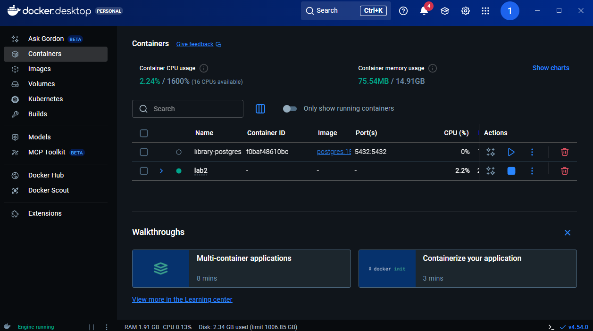
    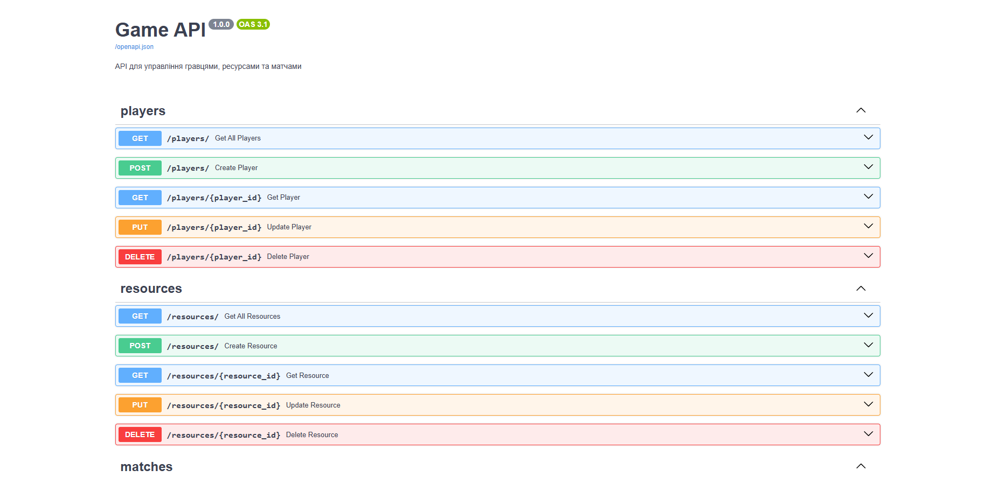
    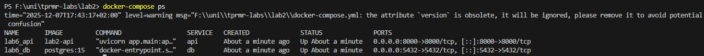
    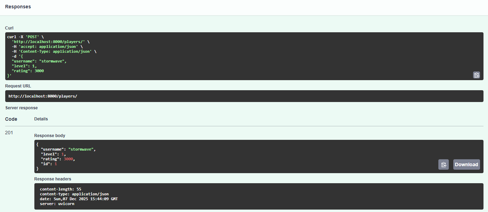
    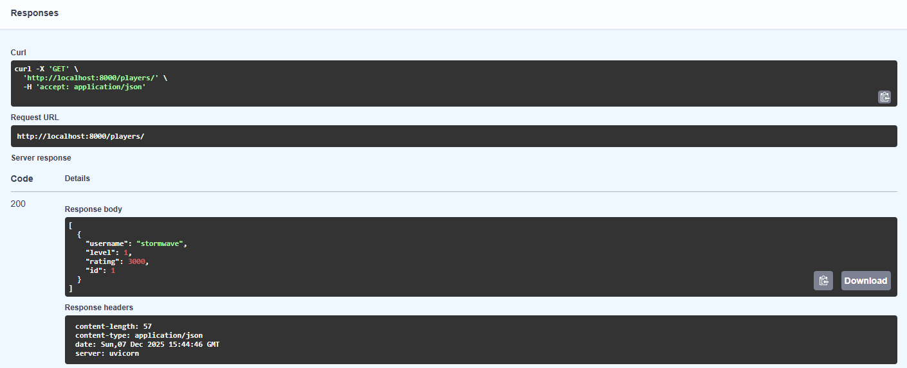
    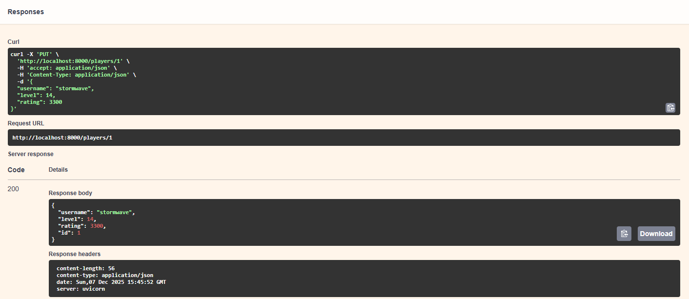
    
    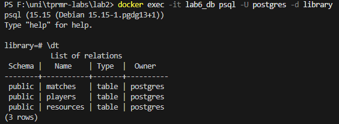
    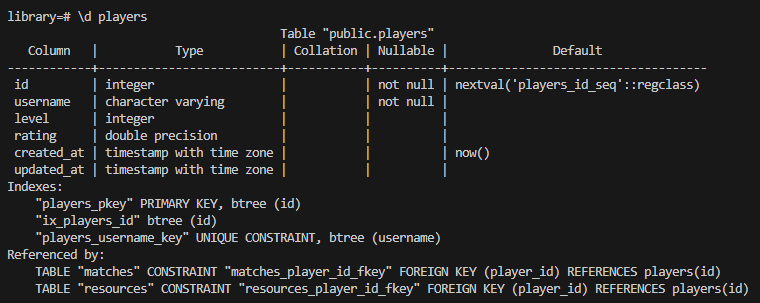
    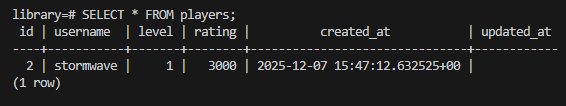

    ## Реалізовані особливості

    - **Валідація даних**: використано Pydantic схеми з обмеженнями типів, мінімальних та максимальних значень для полів гравців, ресурсів та матчів (username, level, amount, duration, status)
    - **Пагінація**: параметри skip та limit реалізовані у ендпоінтах GET /players/, GET /resources/, GET /matches/
    - **Фільтрація**: фільтр за player_id для ресурсів, фільтр за status для матчів
    - **Статистика:** ендпоінт /matches/stats/summary повертає кількість матчів, їх статуси, середню тривалість та відсоток завершених
    - **Документація**: автоматично генерується Swagger UI (/docs) та ReDoc (/redoc)
    - **Обробка помилок**: коректні HTTP статус коди та повідомлення
    - **Контейнеризація**: весь стек сервісів запущено через Docker Compose, включно з FastAPI-додатком та PostgreSQL. Контейнери автоматично перезапускаються при збоях, а томи забезпечують збереження даних після перезапуску.
    - **Оптимізація образу**: використано Dockerfile з правильним порядком інструкцій для кешування шарів та .dockerignore для виключення непотрібних файлів, що прискорює побудову образу і зменшує його розмір.